# Руководство пользователя

## Вход в систему

При первом входе на сайт, вы увидите следующее:

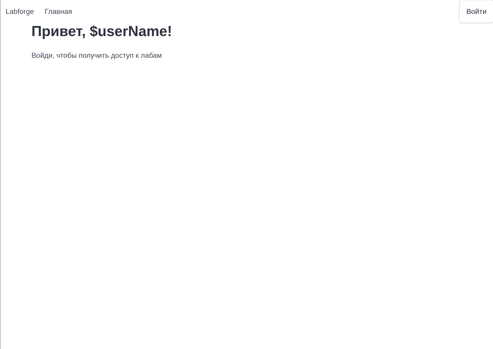

Для входа нажмите кнопку в правом верхнем углу. После этого, вы будете направлены на страницу ввода своих учетных данных

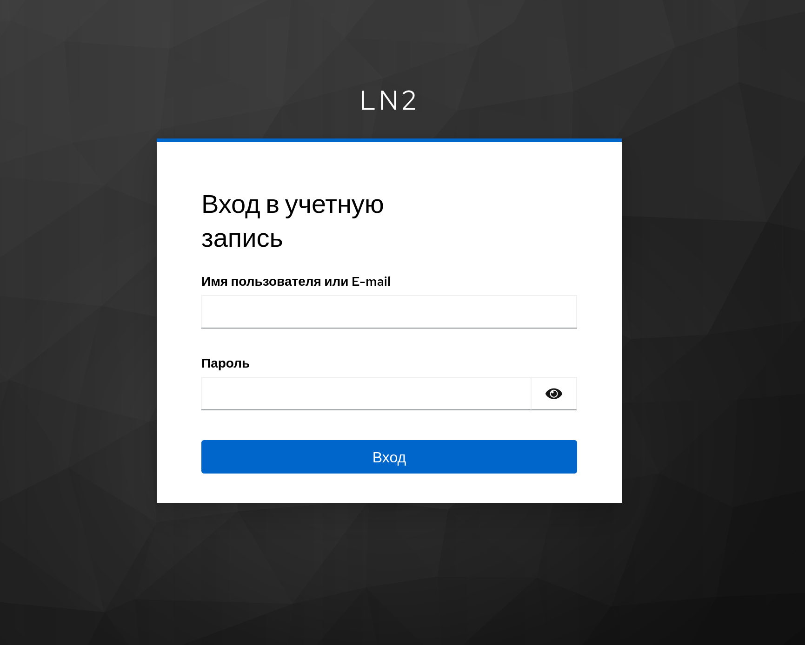

**Введите учетные данные от аккаунта своей образовательной организации, если вам не даны другие инструкции.**

После успешного входа, вы будете перенаправлены на главную страницу, где будет указан логин, под которым вы зашли, а также
доступные стенды, если таковые имеются.

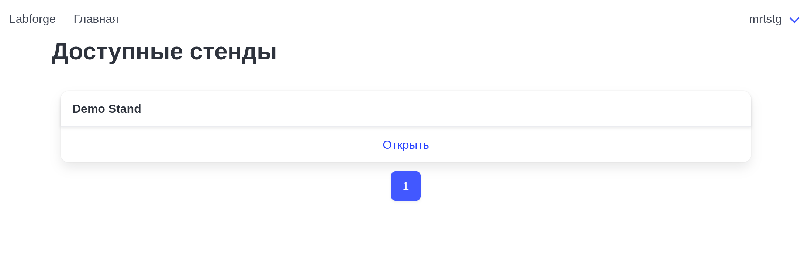

### Что, если я не могу войти?

- Попробуйте войти чуть позже
- Вернитесь на главную страницу сайта и снова нажмите кнопку входа, после чего повторите попытку
- Обратитесь к преподавателю или системному администратору

## Безопасный выход

В случае если вы будете бездействовать на сайте, через некоторое время, вы можете обнаружить что ваша сессия закончилась.
Однако при попытке войти, вы можете заметить, что ваши данные для входа не потребовались.

Для того чтобы выйти без возможности быстрого возообновления сеанса, воспользуйтесь кнопкой "Выйти", наведясь на свое имя пользователя.

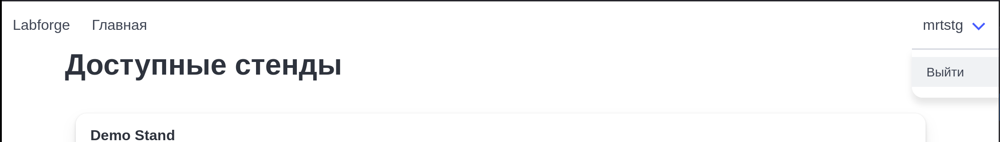

После, подтвердите свое намерение выйти

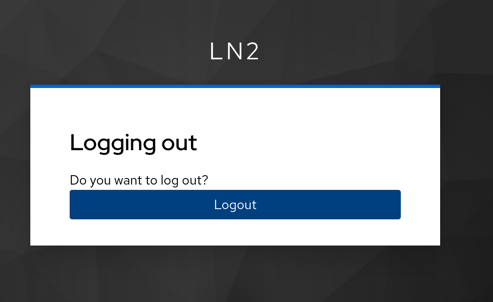

И после того как вы увидите сообщение ниже, вы в безопасности!

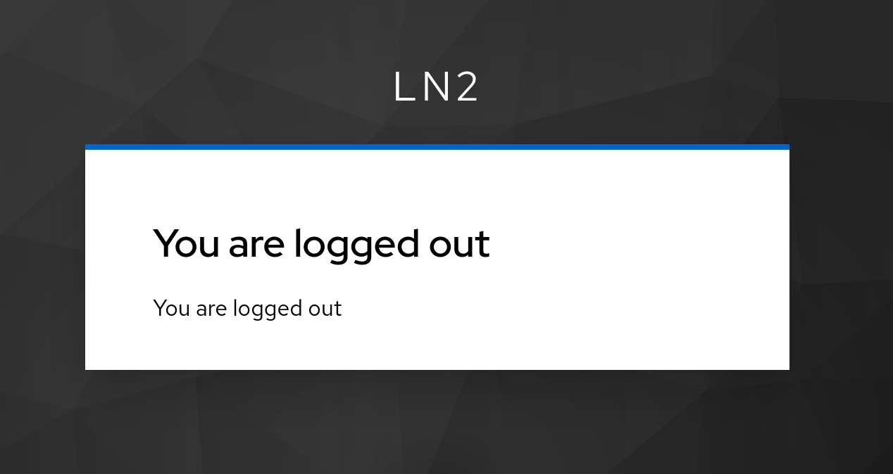

### Почему так происходит

При попытке входа на сайт, создается отдельная SSO-сессия в Keycloak и данные сессиии могут иметь разное время длительности. При попытке
войти на сайт автоматически используется SSO-сессия, по этой причине не требуется повторный ввод данных.

## Использование стендов

Выберите доступный вам стенд и нажмите кнопку "Открыть". Может потребоваться некоторое время для загрузки всей информации.

Если вы видите следующее сообщение или ему подобное, стенд не готов для открытия:

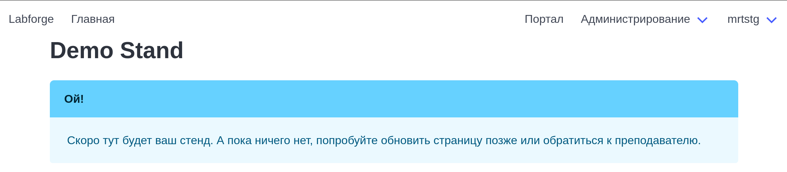

На это есть несколько основных причин:

- Система создает ваш стенд и пока это не завершилось. По готовности, стенд будет доступен
- Ваш стенд не удалось развернуть. Если ваш стенд уже длительное время находится в данном состоянии, обратитесь к преподавателю или системному администратору

В случае, если ваш стенд готов, вы увидите примерно следующую страницу

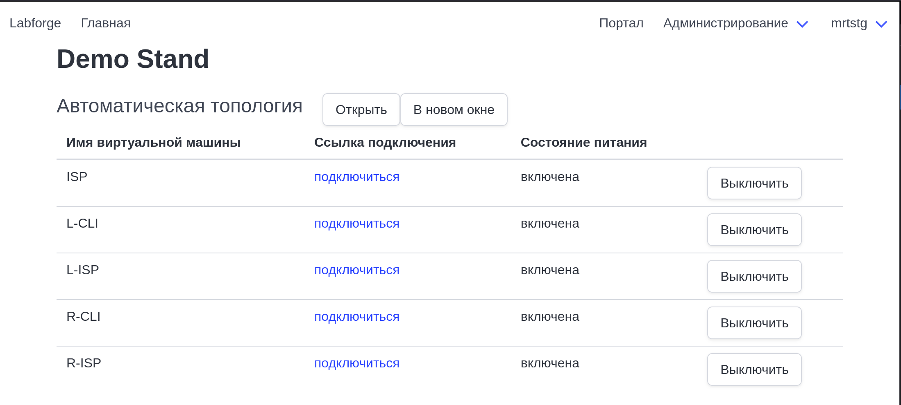

### Автоматическая топология

Для каждого стенда генерируется автоматическая топология - она доступна для открытия в двух размерах:

**На той же странице**

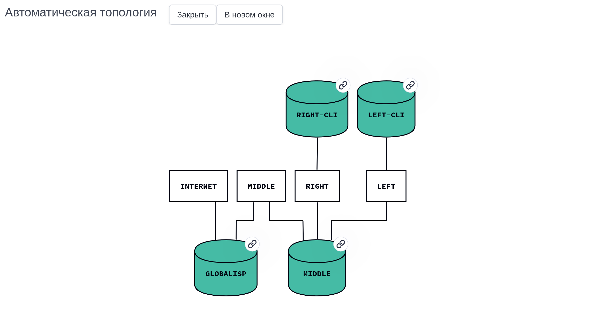

**В отдельном окне в увеличенном виде при нажатии на кнопку "В новом окне"**

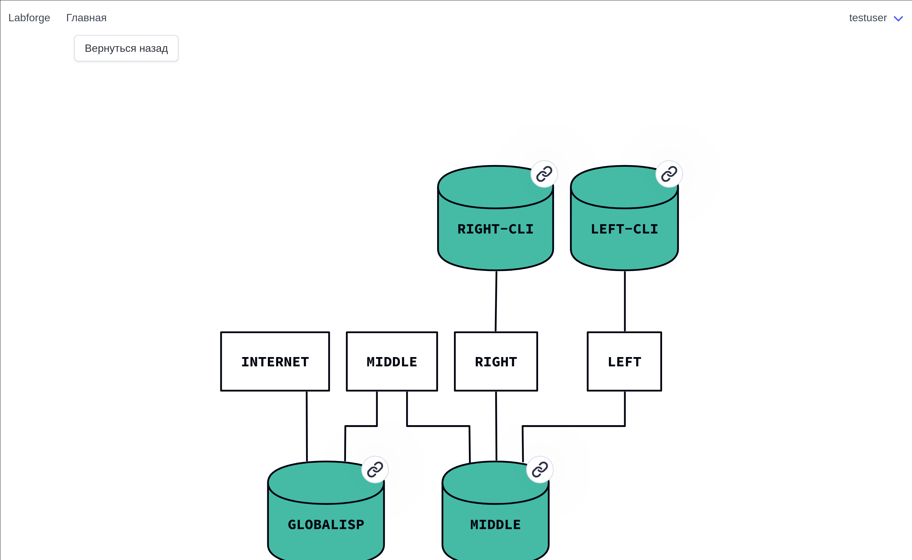

На топологии изображаются сети (прямоугольные объекты) и виртуальные машины (цилиндрические объекты), а также их подключения друг к другу.
**Объекты, в правом верхнем углу которых находится иконка ссылки доступны для открытия по нажатию на них**. В случае нажатия на виртуальную машину,
вы откроете окно подключения к ней.

### Таблица подключений

Таблица содержит аналогичные топологии имена виртуальных машин, ссылку для подключения к ней, а также ее состояние. Пользователь имеет
возможность **раз в 10 секунд** провести переключение питания виртуальной машины, во избежания проблем со стороны гипервизора. При попытке провести операцию
**чаще, чем раз в 10 секунд**, запрос будет игнорироваться.

После нажатия на кнопку и завершения операции вы будете перенаправлены заново на окно стенда с обновленной информацией о виртуальных машинах.
В случае если состояние виртуальной машины осталось тем же, подождите некоторое время и обновите страницу.

## Подключение к виртуальной машине

При переходе по ссылке для подключения к виртуальной машине, в случае если она выключена, вы увидите следующее сообщение

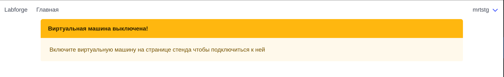

В таком случае, **вернитесь на страницу стенда** и включите виртуальную машину. После повторите попытку.

В случае, если виртуальная машина была включена, вы увидите страницу со следующим примерным содержанием

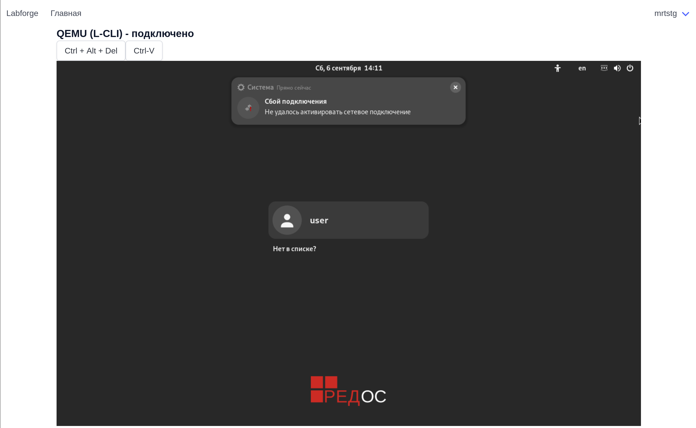

В заголовке вкладки браузера, а также заголовке страницы вы можете увидеть, к какой виртуальной машине выполнено подключение. В случае,
если возникнут какие-либо проблемы **каждые 5 секунд** будет проводиться повторная попытка подключения, а состояние подключение 
в заголовке изменится

Под заголовком находятся служебные клавиши для отправки комбинаций. На изображении это кнопка отправки `Ctrl-Alt-Del` и вставка из буфера обмена.

Пролистав ниже, вы можете ознакомиться с таблицей сетевых подключений. В ней указан MAC-адрес виртуальной машины и название сети, в которую он подключен.
**Название сети совпадает с названием сети в топологии.**

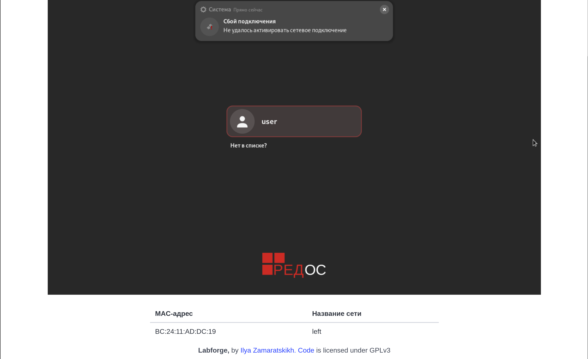
